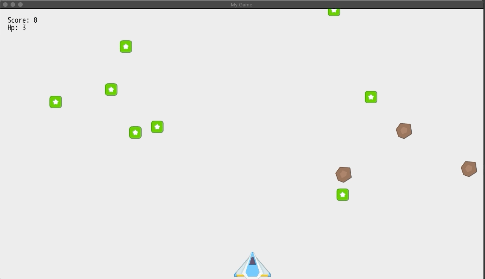

# Introduction à Dragonruby

Ce répertoire git contient le code source et les assets lié à [notre article]()
d'introduction à [Dragonruby](https://dragonruby.itch.io/dragonruby-gtk)

# Démonstration

A la fin de l'article vous devriez avoir l'équivalent du code source présent ici,
et les rendu devrait être similaire à ça:

